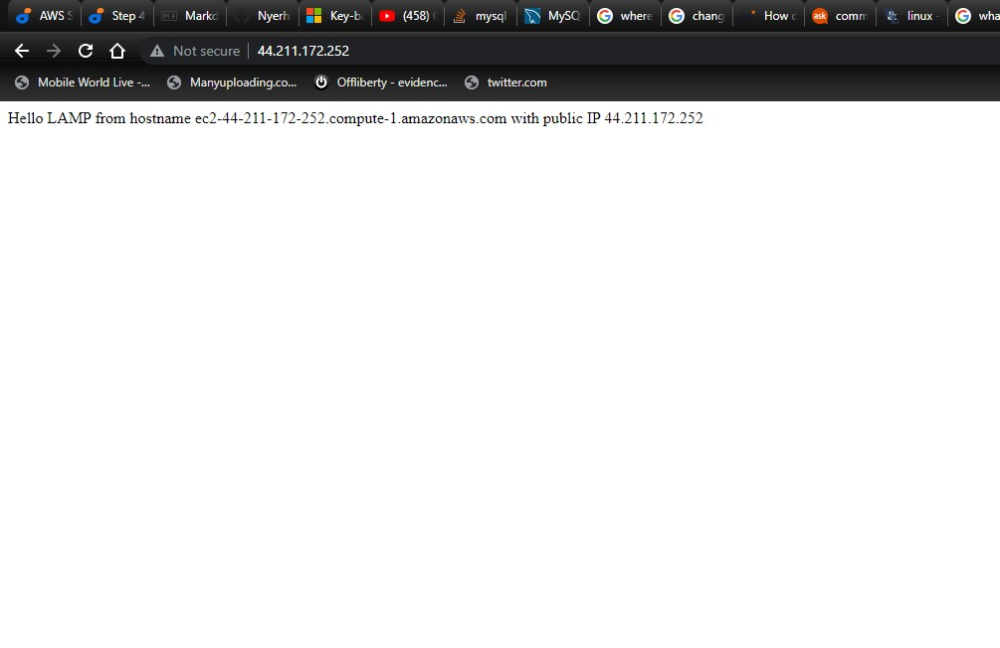

# Project 1: STEP 1
## INSTALLING APACHE AND UPDATING THE FIREWALL

**update the list of packages in the package manager**

`sudo apt update`

**Install the apache2 package**

`sudo apt install apache2`

**verify if the apache service is running**

`sudo systemctl status apache2`


**Try to access the server from our shell**

`curl http://127.0.0.1:80`


# Project 1: STEP 2 
### INSTALLING MYSQL

`sudo apt install mysql-server`

###After MySQL is installed, Log into the MYSQL console as root admin.**

`sudo mysql`


### Set a password using mysql_native_passsword as default auth method. The password in this case is PassWord.1

`ALTER USER 'root'@'localhost' IDENTIFIED WITH mysql_native_password BY 'PassWord.1';`


### Exit the shell and run a security script that will remove some insecure security settings and restrict access to our database.


`mysql> exit`

`sudo mysql_secure_installation`

### Running the script above first prompts you for the root user password, i.e PassWord.1


### Then you are prompted to configure ==VALIDATE PASSWORD PLUGIN==. You can choose "YES" or "NO". NOTE that regardless of if you choose to configure this plugin the server will ask you to select and confirm a password for MySQL root user. The added advantage of choosing to configure the plugin is that it improves security as it may reject the password chosen by you if it doesn't meet the specified password policy chosen. We will see that below.


### A new password has been set for the root user. Enter yes for all other prompts.

### Now try logging into the MySQL console and input your root password when prompted. Exit if it's successful

 `sudo mysql -p`

  `exit`

# Project 1: STEP 3
### INSTALLING PHP.

### Install PHP to process the code and give a display to the end-user, php-sql to allow php communicate with our sql database and libapache2-mod-php to enable apache handle php files.** 

`sudo apt install php libapache2-mod-php php-mysql`

### Confirm that php has been installed
`php -v`


**Our LAMP Stack has been installed now.**

- Linux
- Apache Server
- MySQL
- PHP

# Project 1: STEP 3
### Creating a Virtual Host For Our Website Using Apache

### create a directory called projectlamp
 `sudo mkdir /var/www/projectlamp`

### Assign ownership of the directory to the current user
 ` sudo chown -R $USER:$USER /var/www/projectlamp`

 ### Create a new config file in the apache's sites-available with the following text: 
 ```
 <VirtualHost *:80>
    ServerName projectlamp
    ServerAlias www.projectlamp 
    ServerAdmin webmaster@localhost
    DocumentRoot /var/www/projectlamp
    ErrorLog ${APACHE_LOG_DIR}/error.log
    CustomLog ${APACHE_LOG_DIR}/access.log combined
</VirtualHost>
```
 
 `sudo vi /etc/apache2/sites-available/projectlamp.conf`

 ### Enable the new virtual host using the a2ensite command
 `sudo a2ensite projectlamp`

 ### Disable the default website installed in apache so it doesn't overwrite your virtual host.
`sudo a2dissite 000-default`

### Ensure your configuration has no syntax errors.
`sudo apache2ctl configtest`


### Reload Apache so the changes take place
`sudo systemctl reload apache2`

### Go to the /var/www/projectlamb and create an index.html file so we can test that por virtual host works.
`sudo echo 'Hello LAMP from hostname' $(curl -s http://169.254.169.254/latest/meta-data/public-hostname) 'with public IP' $(curl -s http://169.254.169.254/latest/meta-data/public-ipv4) > /var/www/projectlamp/index.html`

### Open the website url
`http://<Public-IP-Address>:80`


# Project 1: STEP 3
### Enable PHP on the website

### Give index.php file precedence over the index.html file in the DirectoryIndex settings. create a config file with the insert the following.

`sudo vim /etc/apache2/mods-enabled/dir.conf`
```
<IfModule mod_dir.c>
        #Change this:
        #DirectoryIndex index.html index.cgi index.pl index.php index.xhtml index.htm
        #To this:
        DirectoryIndex index.php index.html index.cgi index.pl index.xhtml index.htm
</IfModule>
```
 

### Reload apache so the chnages takes effect
`sudo systemctl reload apache2`

### Create a php script to test that php is correctly installed and configured on our server. create the index.php script in our custom web root folder using vim and insert the following:
`vim /var/www/projectlamp/index.php`

```
<?php
phpinfo();
```


### Save and refresh our home page.
### remove the index.php file after viweing as it dsplays sensitive information about our environment.
`sudo rm /var/www/projectlamp/index.php`

